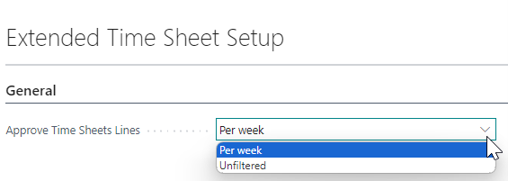
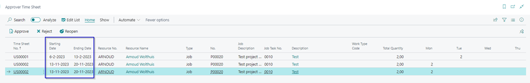

# Manual Extended Time Sheets
Do you want the user responsible for a Job to approve the resource hours written on the project, with this extension you can set a time sheet approver on a Job. 

## Approve Time Sheets

### Time Sheet Line To Approve
The time sheet lines to approve can be found under Self-Service, section Approvals on the tile **Time Sheet Lines To Approve**. To approve the time sheet you can use this option if for example you don’t want to approve the time sheet lines per week but per month. 
This option is set on the **Extended Time Sheet Setup** page. In the field Approve Time Sheets Lines you have the choice of **Per Week** or **Unfiltered**.

When using the **Unfiltered** setting then you will use the Extended Time Sheet Page to approve the time sheet lines, were you see all the time sheet lines to be approved in a list page. Where the Starting- and Ending Date corresponds to the week date of the Time Sheet.

Changing the Approve Time Sheets Lines field to Unfiltered will also change the behavior of the Tile the **Time Sheet Lines to Approve** under Approvals on the Role Center.

### Processing Time Sheet Lines to be approved
The Approver Time Sheet Page shows the hours linked to the relevant approver. Under the **Home** button in the menu there are three option, **Approve**, **Reject** and **Reopen**. Processing works equal to standard Business Central.

*	**Approve** > the option to approve the **Selected line(s)** only or **All Submitted line(s)** > The Status of the Time Sheet Line(s) changes to **Approved**.
*	**Reject** > the option to reject the **Selected line(s)** only or **All Submitted line(s)** > The Status of the Time Sheet Line(s) changes to **Rejected**. The user can see on the Role Center on the tile **Rejected Time Sheets** under Self-Service the number of rejected time sheet lines.
*	**Reopen** > the option to reopen the **Selected line(s)** only or **All Approved  line(s)** > The Status of the Time Sheet Line(s) changes to **Submitted**. This action is used when a time sheet line is already approved and not posted yet. After the approver has reopened the time sheet line and the status is changed to Submitted then the user can reopen the time sheet line and make the adjustments.

[:arrow_left:](../README.md) [Back](../README.md)