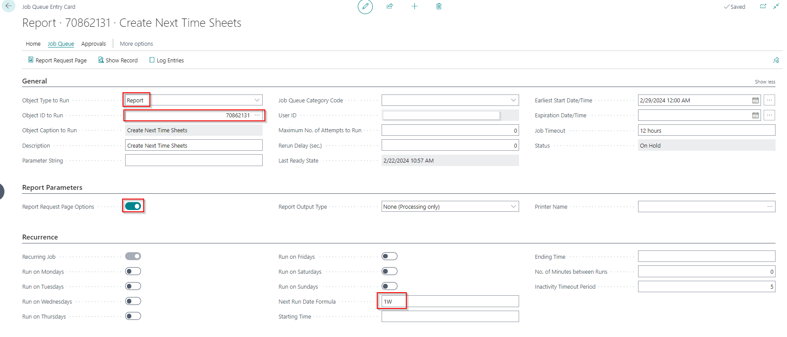
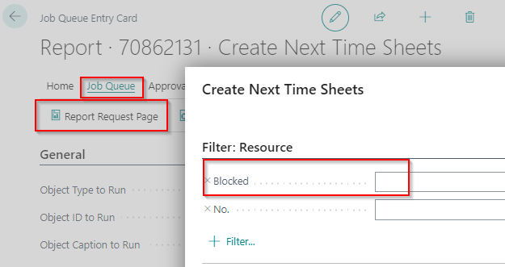

# Manual Extended Time Sheets
Do you want the user responsible for a Job to approve the resource hours written on the project, with this extension you can set a time sheet approver on a Job. 

## Create next Time Sheets via Job Queue Entries
In the Extended Time Sheets solution a report is available to automate the creation of the **Next Time Sheets** to be setup in the **Job Queue Entries**. This way every start of the week the next time sheet is available for each resource.

Please note: the user setting up the job queue entries must be a Time Sheet Admin (setup in the user setup).

1.	Choose the Search icon, enter **Job Queue Entries** and choose the related link.
2.	Select **+New**.
3.	Select in the field **Object Type to Run > Report**.
4.	Enter in the field **Object ID to Run** number **70862131** (Create Next Time Sheets)
5.	Enter in the field **Earliest Start Date/Time** a **Sunday at 00:00 hours** (14-11-2023 00:00) then Monday morning the Time Sheets are available.
6.	Select the action **Job Queue** via the menu.
7.	And then the action **Report Request Page**.
8.	Select under Fast Tab **Filter: Resource > +Filter…**
9.	Select the field **Blocked** and select in the field **Blocked** > **No.** and press **Ok**.
10.	Fill under Fast Tab **Recurring** in the field **Next Run Date Formula** a date formula > **1W**.
11.	The task to create the next time sheets is now created and has the status **On Hold**.
12.	Via the action **Set Status to Ready** the job queue entry is ready and is scheduled to run at the earliest Date/Time set in point 5.

[:arrow_left:](../README.md) [Back](../README.md)