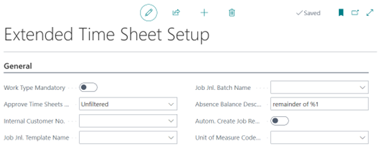
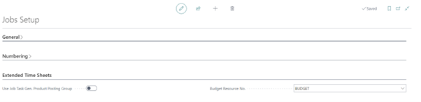

# Manual Extended Time Sheets
Do you want the user responsible for a Job to approve the resource hours written on the project, with this extension you can set a time sheet approver on a Job. 

## Extended Time Sheet Setup

### Extended Time Sheet Setup
In the Extended Time Sheet setup page default setting can be set for the way you want to work with the solution.

Hover over the field name for more information.

### Extended Time Sheet settings on Jobs setup page

Hover over the field name for more information.

[:arrow_left:](../README.md) [Back](../README.md)