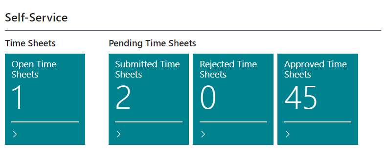
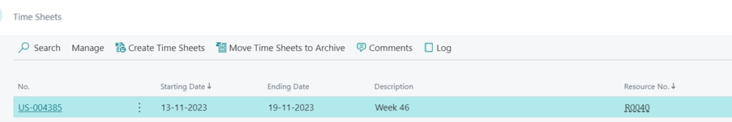
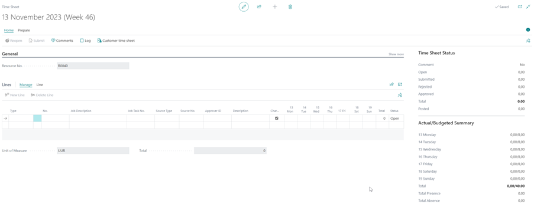
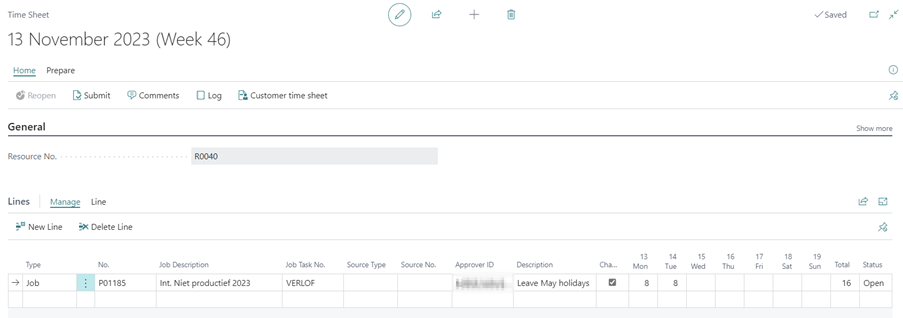
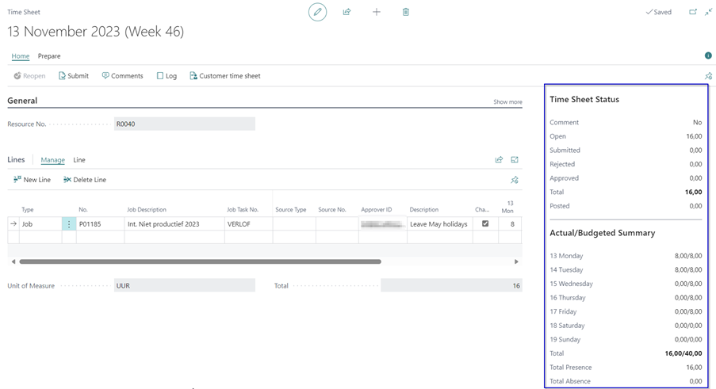
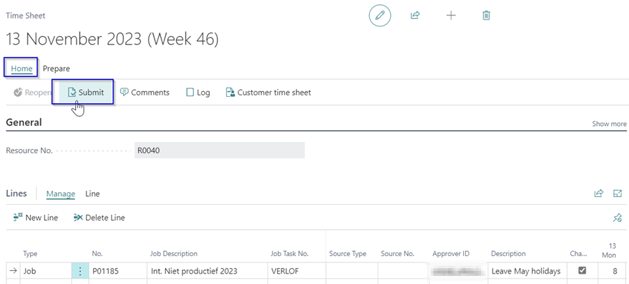

# Manual Extended Time Sheets
Do you want the user responsible for a Job to approve the resource hours written on the project, with this extension you can set a time sheet approver on a Job. 

## Fill Time Sheets

### Open Time Sheets
From your Role Center, open the Time Sheet via the Tile **Open Time Sheets** in het Fast-Tab **Self-service**. 

Select the relevant time sheet by clicking on the Time Sheet number.

The time sheet can be filled.

### Fill the Time Sheet
1.	In the field **Type**, select the type **Job**.
2.	In the field **No.** select the desired job number. In this view only the jobs are visible where the resource is link as a ‘job resource’.
3.	In the field **Job Task No.** select the related task.
4.	Fill in the **Description** field a description of the related line.
5.	Enter your hours in the related fields of the days of the week.

In the Fact box you see an overview of the filled hours of that week with, among other things, the status of the time sheet and an overview of the actual hours per day and total.

### Submit a Time Sheet for approval
After the time sheet has been completed, it must be submitted to the Time Sheet Approver. The approver is visible per line in the time sheet, in the Time Sheet Approver User ID field. This is the time sheet approver that is setup on the Job card (Time Sheet Appr. User ID).

1.	On the time sheet card select the **Submit** action under Home from the menu.
2.	The status of the time sheet lines are changed to **Submitted**.

### Reopen Time Sheet
If the time sheet has the status **Submitted**, it can be reopened by the user and adjustments can be made to the lines. After that, the lines can be submitted again.
Approved time sheet lines can no longer be reopened by the user. However, these lines can be reopened by the approver, which will reset the status to Submitted, after which the user can reopen the lines again.

1.	On the Time Sheet page, choose the action **Reopen** under Home in the menu.
2.	The status of the time sheet changes to **Open**.
3.	Adjust the time sheet line.
4.	Then choose the action Submit to submit the adjusted time sheet line to the time sheet approver.

[:arrow_left:](../README.md) [Back](../README.md)