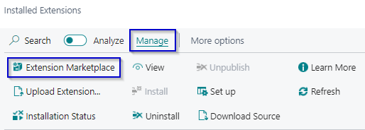

# Manual Extended Time Sheets
Do you want the user responsible for a Job to approve the resource hours written on the project, with this extension you can set a time sheet approver on a Job. 

## Install and activate the app
The following procedure shows how to install the extension through the Extension Management page.
1.	Choose the Search icon, Enter Extension Management, and the choose the related link. 
2.	Choose from the menu the Extension Marketplace action.

    

3.	In the AppSource Apps for Business Central search for **Extended Time Sheets**.
4.	Select the App. 
5.	Select Get It Now. 
6.	Choose from the menu the Deployment Status action. 
7.	Check if the status is Complete.

[:arrow_left:](../README.md) [Back](../README.md)