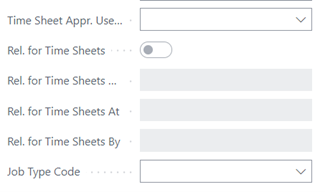
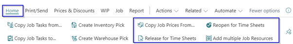
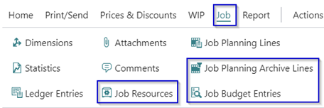

# Manual Extended Time Sheets
Do you want the user responsible for a Job to approve the resource hours written on the project, with this extension you can set a time sheet approver on a Job. 

## Jobs

### Additional fields on the job card

In the Extended Time Sheet solution there are a number of extra fields added to the job card.

Header job card:
*	Time Sheet Appr. User ID
    *	Rel. for Time Sheets Boolean > as an information field
    *	Rel. for Time Sheets On > is release date
    *	Rel. for Time Sheets At > is release time
    *	Rel. for Time Sheets By > user id 
*	Job Type Code > for creating Job Types for internal use.

Job Task:
*	Deferral Code >

Actions in menu:
*	Home
    *	Copy Job Prices From..
    *	Release for Time Sheets
    *	Reopen for Time Sheets
    *	Add multiple Job Resources

*	Job
    *	Job Resources
    *	Job Planning Archive Lines
    *	Job Budget entries

*	Report
    *	Customer Time Sheet

### Job budget entries
With the solution it is possible to register a initial budget which is saved in a separate table.
At the first time the Release for Time Sheet action is done all the job planning lines at that moment are copied to the Job Budget Entries table.

There is an additional function on the Job planning lines to be able to make changes to the budget after the Release for Time Sheet is don. With the action **Add Selection To Job Budget Entries** it is possible to make adjustments in the Budget Entries Table. 

### Absences Job

When using a job to register the ‘budget’ and collect the actual holiday/ leave hours is possible to transfer the remaining hours to a new job e.g. if you register the hours per year and have therefore every year a new job.

Please note that the Job must contain exactly the same Job Tasks as far as there are budget entries on the Job Task. When that is not the case, an error must be raised beforehand.

[:arrow_left:](../README.md) [Back](../README.md)