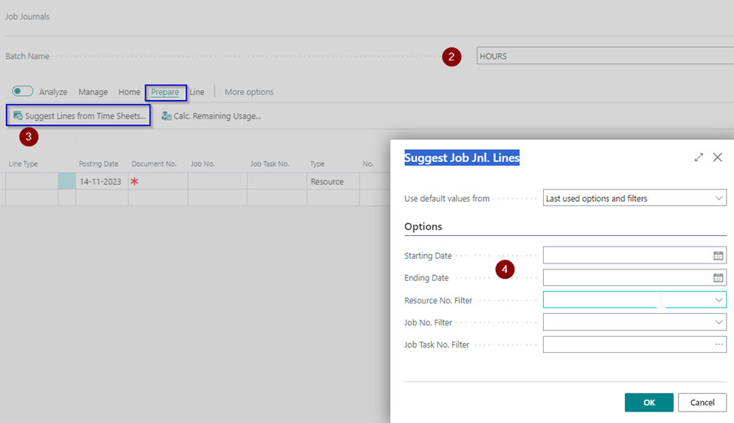
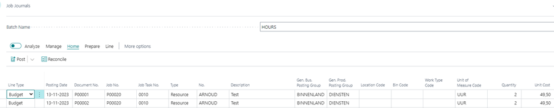

# Manual Extended Time Sheets
Do you want the user responsible for a Job to approve the resource hours written on the project, with this extension you can set a time sheet approver on a Job. 

## Post approved hours to the jobs
Posting the approved hours action is mostly carried out by the finance department.

Posting the approved hours on the jobs is done via a job journal.

### Job Journal
1.	Choose the Search icon, enter **Job Journals** and choose the related link.
2.	In the **Batch Name** field choose a relevant job journal batch.
3.	Choose the **Suggest Lines from Time Sheets…** action under **Prepare** in the menu.
4.	On the **Suggest Job Jnl. Lines** page fill in the fields if necessary.
5.	Fill in the field **Starting Date** the related date.
6.	Fill in the field **Ending Date** the related date.
7.	If both date fields are kept empty then all approved Time Sheet Lines which are not posted yet are filled in the journal.

The approved lines are filled in the journal. 
Extended Time Sheets solution makes sure that the Line Type used in this job journal is based on the Line Type of the related Job Task Line.

[:arrow_left:](../README.md) [Back](../README.md)