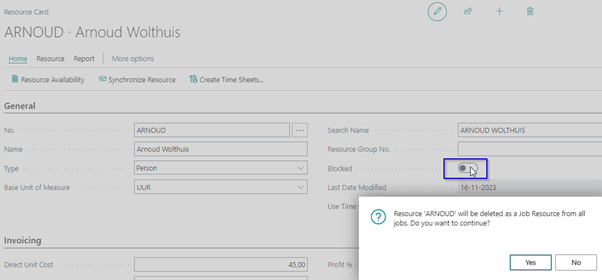

# Manual Extended Time Sheets
Do you want the user responsible for a Job to approve the resource hours written on the project, with this extension you can set a time sheet approver on a Job. 

## Resources

### Off boarding - set a resource to blocked
When a resource leaves the company you want to ensure that the resource cannot be selected anymore as a Job resource on a Job.
When a resource is set to **Blocked** the question to remove the Job Resources from all the jobs (job resources) will appear. By selecting yes the Resource will be deleted as a Job Resource from all the jobs.

[:arrow_left:](../README.md) [Back](../README.md)