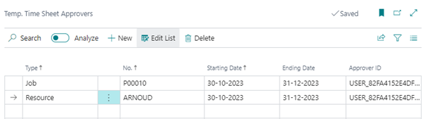

# Manual Extended Time Sheets
Do you want the user responsible for a Job to approve the resource hours written on the project, with this extension you can set a time sheet approver on a Job. 

## Setup a temporary Time Sheet approver
In the Extended Time Sheet solution an option is included to temporarily adjust the job approver on the timesheets. You can use this option, for example, if the approver is going on holiday to temporarily link another approver to his timesheets.

Via the action Temp. Time Sheet Approvers you can specify a temporary approver for a project or a resource by means of a Start- and End Date.

> [!IMPORTANT]
The Starting Date must be equal to the first week day setting in the Resource Setup. Usually this is Monday.
The Ending Date is always a date that corresponds to the last day of the timesheet setting in the Resource Setup. Usually this is Sunday.

1.	In the field Type select e.g. **Job**, or **Resource** the choice depends on how time registration is set up for the company. Usually through **Jobs/projects**.
2.	Select in the **No** field, the desired project
3.	Enter in the **Starting Date** field, the desired date.
4.	Enter In the **Ending Date** field, the desired date.
5.	And finally, in the **Approver ID** field, select the desired approver.

[:arrow_left:](../README.md) [Back](../README.md)